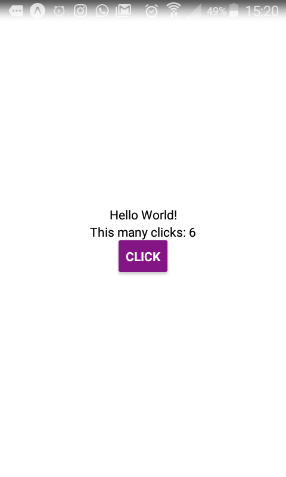
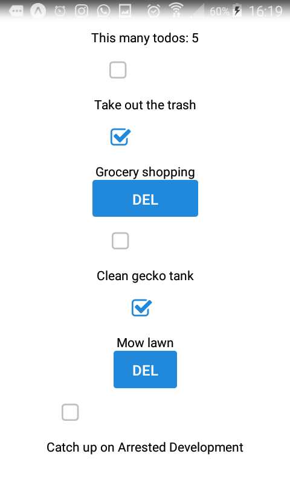

# simpleTodoReactNative

The objective of this project is a simple todo app working on my android phone.
Was inspired by this [awesome tutorial](https://www.youtube.com/watch?v=DLX62G4lc44&list=WL&index=4&t=0s).

I add already made the app up to the state of having todos that I can delete, but I decided to start over so I could set up a proper repository.

I'm remaking the project basically like the first time, just a bit quicker since I had already know some of the mistakes I made the first time, not that I'm good at React, but hopefully it will work, at least this part.

**Used Expo to make this easier, started the project with it and used the app to test on my android phone** To repeat the process I believe you just need it installed, run *expo start* on the directory and then use the app to scan the QR code and done.

## Objective of what I haven't tried
* [ ] Put it up to date with [this rep](https://github.com/ISTeo/simpleTodo) adding storage and ability to add new todos
* [ ] Style this properly
* [ ] Use Cloud storage to retrieve and save todos
* [ ] Add multiple screens
* [ ] Add Timer
* [ ] Add Scrolling

### Hello World

Started this by making a small hello world and a counter that is increased by this button.

### Up to Date 

The objective was to get up to date with the previous attempt at this. Actually went a bit further. 
Previously I only had the sample todos and a checkbox that when clicked deleted them (defeating the purpose of the checkbox). 
Here I added a button to delete the todo only when the checkbox signs that the todo is completed.
